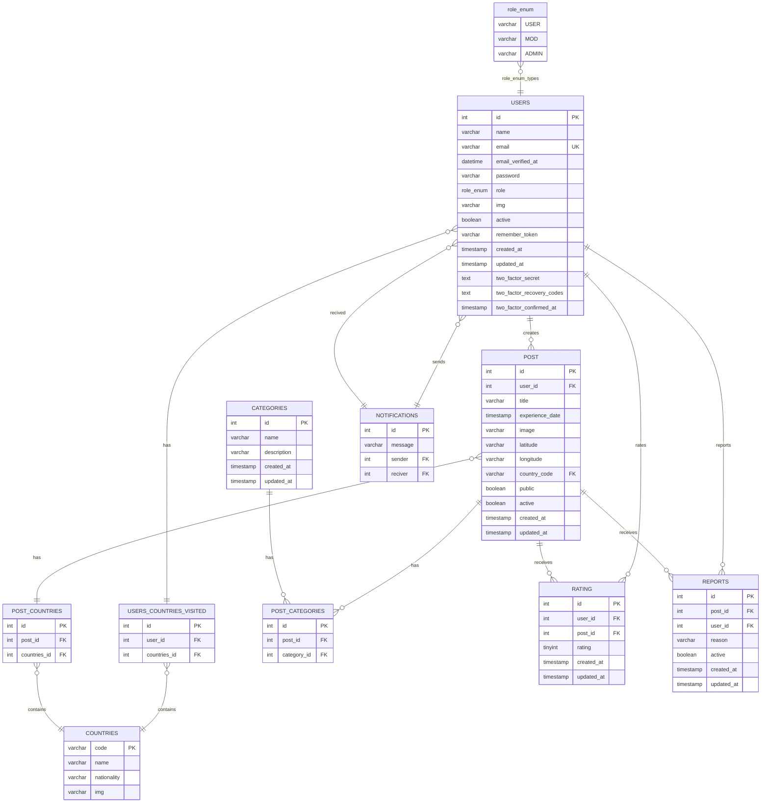
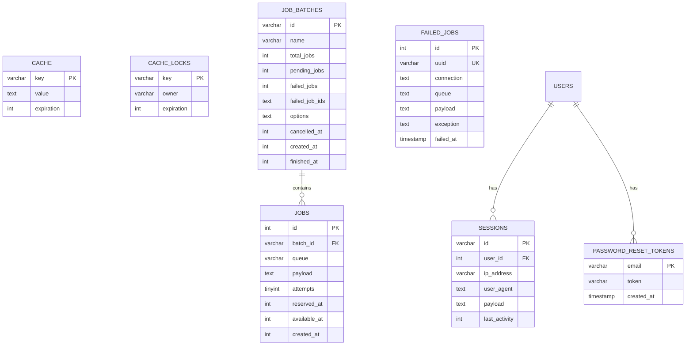

Añadir campo roles segun sufijo a usuario (Default=user, mod, admin)
Añadir tabla notificaciones donde activo no-leida, no-gestionada
Añadir campo nacionalidad y paises visitados a usuario
Añadir tabla paises (Nombre, Abreviacion=ID, nacionalidad, imagen)
Añadir tabla intermedia usuario-paises

    