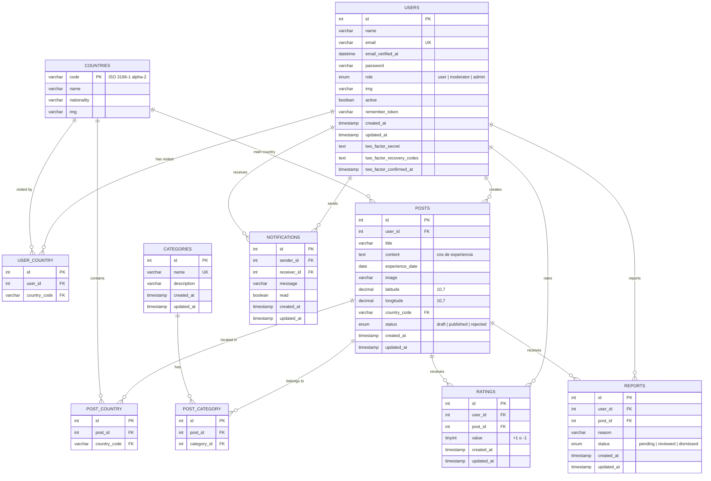
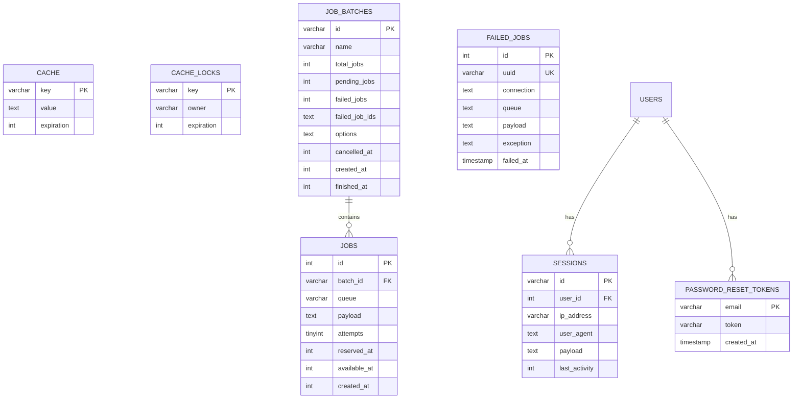

# Pathfinder — Diagrama de Base de Dades

## Notes de disseny
- **Rols d'usuari:** `user` (defecte), `moderator`, `admin` — camp enum a la taula `users`
- **Estats d'experiència:** `draft` (esborrany), `published` (publicada), `rejected` (rebutjada)
- **Estats de report:** `pending`, `reviewed`, `dismissed`
- **Coordenades:** `decimal(10,7)` per compatibilitat amb Leaflet/Google Maps
- **Països:** PK = `varchar code` (ISO 3166-1 alpha-2, ex: "ES", "FR")

## Diagrama principal (negoci)

## Diagrama de suport (Laravel infra)

